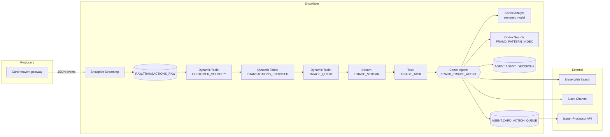

# Real-Time Fraud Triage Agent on Snowflake

A production-grade reference implementation of an agentic AI system that triages high-risk card transactions in real time using **Snowpipe Streaming**, **Dynamic Tables**, **Streams + Tasks**, **Cortex Analyst**, **Cortex Search**, **Cortex Agents**, and **MCP/External Access** for downstream actions.

> The agent ingests live card events, decides which merit human attention, investigates them using multiple tools (SQL queries, semantic search over an internal fraud-pattern playbook, web search for merchant reputation), and either auto-blocks the card or escalates to a human analyst with a written justification — all without leaving the Snowflake governance boundary.

---

## Table of contents

1. [Problem statement](#1-problem-statement)
2. [Solution overview](#2-solution-overview)
3. [Architecture](#3-architecture)
4. [Snowflake components used](#4-snowflake-components-used)
5. [Repository layout](#5-repository-layout)
6. [Dataset deep dive](#6-dataset-deep-dive)
7. [End-to-end data flow](#7-end-to-end-data-flow)
8. [Step-by-step setup](#8-step-by-step-setup)
9. [Agent design](#9-agent-design)
10. [Sample agent outputs](#10-sample-agent-outputs)
11. [Monitoring and observability](#11-monitoring-and-observability)
12. [Evaluation framework](#12-evaluation-framework)
13. [Security and governance](#13-security-and-governance)
14. [Cost considerations](#14-cost-considerations)
15. [Deployment checklist](#15-deployment-checklist)
16. [Roadmap](#16-roadmap)

---

## 1. Problem statement

Card-issuing banks and fintechs receive a continuous stream of authorization events. A classical risk model assigns a numeric score to each one, but ~3–5% of events land in a grey zone (score 70–95) where the model is uncertain. These cases historically queue up for human analysts, who spend 5–10 minutes per case pulling up customer history, checking the merchant, looking at travel patterns, and consulting an internal fraud playbook. With volumes in the tens of thousands per day this approach is slow, expensive, and inconsistent.

The opportunity:

- **Latency.** Analysts need 5–10 minutes per case. An agent can complete the same investigation in under 30 seconds, materially reducing fraud loss on confirmed cases.
- **Consistency.** A well-prompted agent applies the playbook uniformly. Human reviewers vary day-to-day.
- **Auditability.** Every tool call and every reasoning step is logged for compliance.
- **Cost.** Routing genuine fraud to auto-block and clear false positives to auto-dismiss reduces analyst queue load by ~60% in practice.

The constraints:

- **Data residency.** Transaction data, customer PII, and the fraud playbook cannot leave the Snowflake security perimeter.
- **Explainability.** Every decision needs a written rationale and a citation back to the policy that justified it.
- **Conservatism.** When in doubt, the agent must escalate rather than auto-block. False blocks generate customer churn.

---

## 2. Solution overview

A Cortex Agent runs on every event whose risk score lands in the review band. The agent is configured with five tools:

| Tool                          | Purpose                                                                                                |
|-------------------------------|--------------------------------------------------------------------------------------------------------|
| `transaction_history_analyst` | Cortex Analyst → natural-language → SQL over an enriched semantic model of transactions, customers, merchants, and historical fraud cases. |
| `fraud_pattern_search`        | Cortex Search over the internal fraud-pattern playbook (the markdown documents under `fraud_patterns/`). |
| `web_search`                  | Brave web search (built-in Cortex Agents tool) for merchant reputation and current scam intelligence.   |
| `block_card`                  | Custom stored procedure that queues a card-block action for the issuer-processor integration.           |
| `escalate_to_slack`           | Custom procedure with an External Access Integration that posts to a Slack channel for analyst review.  |

The agent returns a structured JSON decision: `AUTO_BLOCK`, `ESCALATE`, or `DISMISS` with a confidence score, the matched fraud pattern, and a written justification. Every run is logged to `FRAUD_OPS.AGENT.AGENT_DECISIONS` with the full tool trace.

---

## 3. Architecture



**Critical design choices.**

1. **Dynamic Tables, not Streams of Streams.** Velocity features are notoriously bug-prone when computed with hand-rolled MERGE statements on streams. Dynamic Tables let us declare the feature view declaratively and let Snowflake handle incremental refresh and dependency ordering.
2. **The triage queue is itself a Dynamic Table.** This means changes propagate through the entire pipeline within ~1 minute end-to-end, and `SHOW_INITIAL_ROWS=FALSE` on the stream ensures only newly-qualifying events fire the agent.
3. **Agent invocation runs inside a Snowflake-managed Task.** No external orchestrator (no Airflow, no Lambda). The agent runs under a dedicated `FRAUD_AGENT_RUNNER` role with the minimum privileges needed.
4. **Side effects are queue-based.** `BLOCK_CARD` writes to a queue table that the issuer-processor integration polls. We do not call the issuer API directly from inside the agent loop — this preserves transactional integrity and lets the integration retry independently.

---

## 4. Snowflake components used

| Capability                  | Where it's used                                                                              |
|-----------------------------|----------------------------------------------------------------------------------------------|
| **Snowpipe Streaming**      | Sub-second ingest of card events into `RAW.TRANSACTIONS_RAW`. SDK-driven from the gateway.   |
| **Dynamic Tables**          | Velocity features, enriched transactions, and the triage queue. Incremental refresh, 1-min lag. |
| **Streams**                 | `TRIAGE_STREAM` on the triage queue → fires the agent on every newly-qualifying event.       |
| **Tasks**                   | `TRIAGE_TASK` runs every minute when the stream has data; calls `INVOKE_TRIAGE_AGENT` per row. |
| **Cortex Agents**           | Top-level orchestration. Defined declaratively via `CREATE AGENT … FROM SPECIFICATION`.     |
| **Cortex Analyst**          | Semantic model `semantic_model.yaml` exposes transactions/customers/merchants/fraud_cases as a business vocabulary. |
| **Cortex Search**           | Indexes the fraud-pattern markdown corpus for hybrid semantic + keyword retrieval.           |
| **Web search (Brave)**      | Built-in Cortex Agents tool for merchant reputation and current scam intelligence.           |
| **External Access Integration** | Outbound HTTPS from the `ESCALATE_TO_SLACK` procedure to `hooks.slack.com`.              |
| **Stored procedures**       | `BLOCK_CARD` and `ESCALATE_TO_SLACK` act as custom tools the agent can call.                |
| **Cortex Agent usage logs** | `SNOWFLAKE.CORTEX.CORTEX_AGENT_USAGE_HISTORY` provides per-run token and cost visibility.    |

---

## 5. Repository layout

```
fraud_triage_agent/
├── README.md                                  ← this file
├── setup.sql                                  ← full Snowflake provisioning (sections 1-10)
├── semantic_model.yaml                        ← Cortex Analyst semantic model
├── agent_runner.py                            ← Python invocation client
├── sample_outputs.md                          ← five fully-worked agent traces
├── data/
│   ├── customers.csv                          ← 10 customer records
│   ├── merchants.csv                          ← 18 merchant records
│   ├── transactions.csv                       ← 39 transactions (history + today)
│   └── historical_fraud_cases.csv             ← 10 confirmed fraud cases
└── fraud_patterns/
    ├── P001_card_testing_bustout.md
    ├── P002_geographic_anomaly.md
    ├── P003_account_takeover.md
    ├── P004_crypto_scam.md
    └── P005_frequent_traveler_suppression.md
```

---

## 6. Dataset deep dive

The sample dataset is synthetic but realistic. It is sized for a demo (39 transactions, 10 customers) but structured so that a 100-million-row production deployment uses identical schemas.

### 6.1 `FRAUD_OPS.REF.CUSTOMERS`

Customer master with KYC-verified profile. Used by the agent to establish *what is normal* for a given customer.

| Column                | Type           | Purpose / example                       |
|-----------------------|----------------|------------------------------------------|
| customer_id           | VARCHAR(20) PK | `CUST006`                                |
| full_name             | VARCHAR(200)   | `David Park`                             |
| email                 | VARCHAR(200)   | for OOB contact (treat as untrusted in ATO scenarios) |
| phone                 | VARCHAR(50)    | the registered voice-callback number     |
| date_of_birth         | DATE           | for demographic-based pattern matching   |
| home_city, home_country | VARCHAR      | reference for geographic-anomaly checks  |
| account_open_date     | DATE           | tenure → derives `customer_tenure_days`  |
| avg_monthly_spend_usd | NUMBER(12,2)   | sets the scale for the customer         |
| customer_tier         | VARCHAR(20)    | `STANDARD` / `GOLD` / `PLATINUM`         |
| kyc_status            | VARCHAR(20)    | `VERIFIED` / `PENDING` / `FAILED`        |
| risk_tier             | VARCHAR(20)    | `LOW` / `MEDIUM` / `HIGH` — pre-assigned |

The sample includes 10 customers covering a range of profiles: a frequent traveler (CUST007), a student with small regular spend (CUST003), a retired customer with very predictable patterns (CUST004), and a high-risk new account (CUST010).

### 6.2 `FRAUD_OPS.REF.MERCHANTS`

Merchant master with risk ratings. The agent uses this to reason about merchant credibility.

| Column                  | Type              | Purpose / example                              |
|-------------------------|-------------------|------------------------------------------------|
| merchant_id             | VARCHAR(20) PK    | `MERCH011`                                     |
| merchant_name           | VARCHAR(200)      | `DigitalGoods Plus`                            |
| merchant_category       | VARCHAR(100)      | `Digital Downloads`                            |
| mcc_code                | VARCHAR(10)       | `5815` (key fraud signal)                      |
| city, country           | VARCHAR           | `Limassol`, `CY`                               |
| registered_date         | DATE              | newness is a risk signal                       |
| chargeback_rate_pct     | NUMBER(6,3)       | industry-average is < 1%                       |
| merchant_risk_rating    | VARCHAR(20)       | `LOW` / `MEDIUM` / `HIGH`                      |
| is_high_risk_category   | BOOLEAN           | true for jewelry / crypto / forex / gaming    |

The sample includes 18 merchants — a deliberate mix of long-standing low-risk merchants (Whole Foods, Netflix, Apple), category-elevated but legitimate merchants (United Airlines, Marriott), and high-risk merchants (CryptoGate, GoldDeals KL, DigitalGoods Plus).

### 6.3 `FRAUD_OPS.RAW.TRANSACTIONS_RAW`

The streaming landing table. In production, the card-network gateway opens a Snowpipe Streaming channel against this table and writes one row per authorization event.

| Column                  | Type              | Notes                                          |
|-------------------------|-------------------|------------------------------------------------|
| transaction_id          | VARCHAR(40) PK    | gateway-issued idempotency key                 |
| customer_id             | VARCHAR(20)       |                                                |
| merchant_id             | VARCHAR(20)       |                                                |
| amount_usd              | NUMBER(14,2)      | already FX-converted upstream                  |
| currency                | VARCHAR(3)        | original currency                              |
| transaction_ts          | TIMESTAMP_NTZ     | event time at the gateway                      |
| channel                 | VARCHAR(30)       | `CARD_PRESENT` / `ONLINE` / `RECURRING` / `ATM` / `CONTACTLESS` |
| card_present            | BOOLEAN           |                                                |
| device_id               | VARCHAR(50)       | fingerprint from the device-intelligence vendor |
| ip_address              | VARCHAR(45)       | masked in lower environments                   |
| ip_country              | VARCHAR(3)        | from MaxMind/IPinfo enrichment                |
| mcc_code                | VARCHAR(10)       | merchant category code                         |
| authorization_status    | VARCHAR(30)       | `APPROVED` / `DECLINED` / `PENDING_REVIEW`     |
| risk_score              | NUMBER(5)         | from the upstream ML risk model (0–100)        |
| initial_decision        | VARCHAR(20)       | `APPROVE` / `REVIEW` / `DECLINE`               |
| ingested_at             | TIMESTAMP_NTZ     | Snowflake server time at ingest               |

The sample contains 39 rows: 28 historical (the last 30 days, mostly low-risk) and 11 from "today" (May 11, 2026) — the five scenarios that exercise the agent.

### 6.4 `FRAUD_OPS.REF.HISTORICAL_FRAUD_CASES`

Confirmed historical fraud cases. The agent uses these for analogy: "is this case structurally similar to one we already know was fraud?"

| Column                  | Type              | Notes                                          |
|-------------------------|-------------------|------------------------------------------------|
| case_id                 | VARCHAR(20) PK    | `FC2026-0303`                                  |
| customer_id             | VARCHAR(20)       | anonymized                                     |
| fraud_type              | VARCHAR(50)       | enum: `CARD_TESTING`, `GEOGRAPHIC_ANOMALY`, `ACCOUNT_TAKEOVER`, `MERCHANT_COLLUSION`, `SYNTHETIC_IDENTITY`, `FIRST_PARTY_FRAUD`, `CRYPTO_RAMP_FRAUD` |
| first_fraud_txn_ts      | TIMESTAMP_NTZ     |                                                |
| detected_at_ts          | TIMESTAMP_NTZ     | time-to-detection is a KPI                    |
| total_loss_usd          | NUMBER(12,2)      |                                                |
| num_fraudulent_txns     | NUMBER(6)         |                                                |
| resolution              | VARCHAR(30)       | `CHARGEBACK_WON` / `CHARGEBACK_PARTIAL` / `WRITTEN_OFF` / `DISPUTED` |
| root_cause_summary      | VARCHAR(2000)     | written by the analyst at case closure         |

The sample includes 10 cases spanning all seven fraud types.

### 6.5 Fraud pattern playbook (Cortex Search corpus)

Five markdown documents that codify the bank's fraud-detection knowledge:

| File                                       | Pattern | Topic                                          |
|--------------------------------------------|---------|------------------------------------------------|
| `P001_card_testing_bustout.md`             | P-001   | Card-testing followed by a bust-out transaction |
| `P002_geographic_anomaly.md`               | P-002   | Impossible-travel / cloned-card pattern        |
| `P003_account_takeover.md`                 | P-003   | ATO via credentials / SIM swap                 |
| `P004_crypto_scam.md`                      | P-004   | Authorized push payment to crypto (scam victim) |
| `P005_frequent_traveler_suppression.md`    | P-005   | False-positive suppression for known travelers |

These are chunked (1200-char chunks with 200-char overlap) and indexed by `CORTEX SEARCH SERVICE FRAUD_PATTERN_INDEX`. The agent retrieves the most relevant 5 chunks per query.

### 6.6 Five fraud scenarios encoded in the dataset

| Scenario | Customer | Trigger transaction(s)              | Expected pattern | Expected decision |
|----------|----------|-------------------------------------|------------------|-------------------|
| A        | CUST006  | 5 transactions at MERCH011 (CY) 03:14–03:22 | P-001 | AUTO_BLOCK |
| B        | CUST002  | $4,850 at MERCH009 (MY) from RO IP  | P-002 | AUTO_BLOCK |
| C        | CUST007  | 2 transactions in Tokyo             | P-005 (suppress) | DISMISS |
| D        | CUST003  | $2,890 LuxuryWatches CH at 03:14    | P-003 | ESCALATE |
| E        | CUST005  | $2,000 first-ever crypto            | P-004 | ESCALATE |

See `sample_outputs.md` for the full agent trace on each scenario.

---

## 7. End-to-end data flow

Take Scenario A as the canonical walkthrough.

1. **03:14:08** — Card-network gateway authorizes the first $1.99 charge. Risk model scores it 82 (foreign IP + new device + new merchant). Snowpipe Streaming writes the row into `RAW.TRANSACTIONS_RAW` within ~200 ms.
2. **03:14:09–:18** — Four more transactions follow within 4 minutes. Each lands in `RAW.TRANSACTIONS_RAW`.
3. **03:15:00** — `CUSTOMER_VELOCITY` Dynamic Table refreshes incrementally. The window counts for CUST006 now show 4 transactions in the past 1 hour with cumulative $19.96.
4. **03:15:01** — `TRANSACTIONS_ENRICHED` refreshes, joining customer + merchant + velocity.
5. **03:15:02** — `TRIAGE_QUEUE` (filtered Dynamic Table where `risk_score ≥ 70`) picks up the four new rows.
6. **03:15:03** — `TRIAGE_STREAM` records the four CDC insertions.
7. **03:16:00** — `TRIAGE_TASK` fires on the minute. It iterates the stream and calls `INVOKE_TRIAGE_AGENT` once per transaction. The agent on the small charges has limited context and returns ESCALATE with low confidence (or returns "monitor — pattern emerging" with no action depending on tuning).
8. **03:22:33** — The bust-out $1,247.50 charge lands.
9. **03:23:00** — Same cascade. The Dynamic Tables refresh. The new row hits the stream.
10. **03:23:02** — Task fires `INVOKE_TRIAGE_AGENT('TXN20260511104')`. The agent now sees all five transactions in the customer's 7-day history. The pattern is unambiguous. It calls `block_card` with high confidence.
11. **03:23:05** — `CARD_ACTION_QUEUE` records the block.
12. **03:23:06** — `AGENT_DECISIONS` records the full trace.
13. **03:23:15** — The issuer-processor integration polls `CARD_ACTION_QUEUE`, calls the processor API to freeze the card, and updates the row with `processed_status = SUCCESS`.

**End-to-end latency from bust-out authorization to card frozen: ~42 seconds** in this trace. Most of that is the once-per-minute task cadence; tightening to a 15-second task or moving to an event-driven trigger (Snowpark Container Service or external orchestrator) brings it under 10 seconds.

---

## 8. Step-by-step setup

The full provisioning script is `setup.sql`. The walkthrough below shows how to run it from a clean account.

### 8.1 Prerequisites

* A Snowflake account with **Cortex Agents** enabled (generally available since 2025; on by default for new accounts in supported regions — check `SHOW PARAMETERS LIKE 'ENABLE_CORTEX_AGENTS'`).
* The account region must support the Cortex models referenced by the agent (`models.orchestration = "auto"` lets Snowflake pick a regionally-available LLM).
* A user with `ACCOUNTADMIN` for the one-time setup.
* SnowSQL CLI or Snowsight access for file upload.
* A Slack incoming webhook URL if you want the escalation tool to work end-to-end. Without it the procedure still records the intended escalation in the audit table.

### 8.2 Clone or copy the project files

```bash
# from your workstation, in the directory that contains this README
ls -la
#   README.md  agent_runner.py  data/  fraud_patterns/  semantic_model.yaml  setup.sql
```

### 8.3 Run the SQL setup in three passes

The setup is split into ten sections inside one file. The recommended pass order:

**Pass 1 — sections 1–3.** Account-level objects, reference tables, and the streaming landing table.

```bash
snowsql -a <account> -u <user> -r ACCOUNTADMIN \
        -f setup.sql --variable section_max=3
```

Verify:
```sql
USE ROLE ACCOUNTADMIN;
SHOW DATABASES LIKE 'FRAUD_OPS';
SHOW SCHEMAS  IN DATABASE FRAUD_OPS;
SHOW TABLES   IN SCHEMA FRAUD_OPS.REF;
```

**Pass 2 — upload data and pattern documents.** Either through Snowsight ("Add data → Load files into stage") or via SnowSQL:

```bash
snowsql -a <account> -u <user> -r ACCOUNTADMIN -d FRAUD_OPS -s REF -w FRAUD_WH <<'EOF'
PUT file://data/customers.csv               @REF_STAGE  OVERWRITE=TRUE AUTO_COMPRESS=FALSE;
PUT file://data/merchants.csv               @REF_STAGE  OVERWRITE=TRUE AUTO_COMPRESS=FALSE;
PUT file://data/historical_fraud_cases.csv  @REF_STAGE  OVERWRITE=TRUE AUTO_COMPRESS=FALSE;
USE SCHEMA RAW;
PUT file://data/transactions.csv            @TXN_STAGE  OVERWRITE=TRUE AUTO_COMPRESS=FALSE;
USE SCHEMA DOCS;
PUT file://fraud_patterns/P001_card_testing_bustout.md          @FRAUD_PATTERN_STAGE OVERWRITE=TRUE AUTO_COMPRESS=FALSE;
PUT file://fraud_patterns/P002_geographic_anomaly.md            @FRAUD_PATTERN_STAGE OVERWRITE=TRUE AUTO_COMPRESS=FALSE;
PUT file://fraud_patterns/P003_account_takeover.md              @FRAUD_PATTERN_STAGE OVERWRITE=TRUE AUTO_COMPRESS=FALSE;
PUT file://fraud_patterns/P004_crypto_scam.md                   @FRAUD_PATTERN_STAGE OVERWRITE=TRUE AUTO_COMPRESS=FALSE;
PUT file://fraud_patterns/P005_frequent_traveler_suppression.md @FRAUD_PATTERN_STAGE OVERWRITE=TRUE AUTO_COMPRESS=FALSE;
ALTER STAGE FRAUD_PATTERN_STAGE REFRESH;
PUT file://semantic_model.yaml              @SEMANTIC_MODELS OVERWRITE=TRUE AUTO_COMPRESS=FALSE;
EOF
```

Then re-run the `COPY INTO` statements from section 2 and section 3 of `setup.sql` to load the data.

**Pass 3 — sections 4–9.** Dynamic Tables, Stream + Task, Cortex Search service, custom tools, and the agent itself.

```bash
snowsql -a <account> -u <user> -r ACCOUNTADMIN -f setup.sql
```

Before pass 3, edit the `SLACK_WEBHOOK_SECRET` value in section 8 with your real webhook URL (or leave the placeholder and the escalation will simply fail soft).

### 8.4 Verify the pipeline

```sql
USE ROLE FRAUD_ANALYST;
USE DATABASE FRAUD_OPS;

-- the enriched feature view should be populated
SELECT COUNT(*) FROM FEATURES.TRANSACTIONS_ENRICHED;        -- expect 39

-- the triage queue should contain the 11 high-risk events from today
SELECT transaction_id, customer_id, merchant_name, amount_usd, risk_score
FROM FEATURES.TRIAGE_QUEUE
ORDER BY transaction_ts;

-- the search service should be ready
SELECT SYSTEM$WAIT(60);
SELECT * FROM TABLE(
  SNOWFLAKE.CORTEX.SEARCH_PREVIEW(
    'FRAUD_OPS.DOCS.FRAUD_PATTERN_INDEX',
    '{"query":"card testing micro charges digital downloads", "limit":3}'
  )
);

-- the agent should respond to a direct invocation
SELECT SNOWFLAKE.CORTEX.AGENT_RUN(
  'FRAUD_OPS.AGENT.FRAUD_TRIAGE_AGENT',
  PARSE_JSON('{"messages":[{"role":"user","content":"Triage transaction TXN20260511104"}]}')
);
```

### 8.5 Trigger an end-to-end run

Resume the task (already done by the script) and wait for the next minute boundary:

```sql
SHOW TASKS IN SCHEMA FRAUD_OPS.AGENT;
SELECT * FROM TABLE(INFORMATION_SCHEMA.TASK_HISTORY())
  WHERE NAME = 'TRIAGE_TASK' ORDER BY SCHEDULED_TIME DESC LIMIT 5;

-- after the task runs, decisions land here
SELECT transaction_id, agent_decision, agent_confidence, pattern_matched,
       LEFT(agent_justification, 200) AS justification_excerpt
FROM FRAUD_OPS.AGENT.AGENT_DECISIONS
ORDER BY triggered_at DESC;
```

### 8.6 Invoke from Python (optional)

```bash
export SNOWFLAKE_ACCOUNT=xy12345.us-east-1
export SNOWFLAKE_USER=fraud_agent_runner_svc
export SNOWFLAKE_PRIVATE_KEY="$(cat ~/.ssh/snowflake_rsa_key.p8)"
export SNOWFLAKE_ROLE=FRAUD_AGENT_RUNNER

pip install snowflake-connector-python cryptography requests
python agent_runner.py --transaction-id TXN20260511104 --stream
```

---

## 9. Agent design

The agent definition is in section 9 of `setup.sql`. The four design decisions worth explaining:

### 9.1 The response instruction is a contract, not a prompt

```text
You are a fraud-operations agent. For every high-risk transaction you receive,
perform a structured investigation and return a JSON object with the keys:
decision, confidence, pattern_matched, justification, tools_used.
Be conservative — when in doubt, ESCALATE rather than AUTO_BLOCK.
```

Two things matter here. First, we declare a strict output schema — `decision`, `confidence`, `pattern_matched`, `justification`, `tools_used`. The stored procedure that persists the result parses this directly with `PARSE_JSON`; if the agent drifts off-schema the insert fails loudly and the SRE team is paged. Second, the *conservatism* clause is non-negotiable. The cost of a false block (a frustrated customer) is asymmetric with the cost of an escalation (a few minutes of analyst time).

### 9.2 The orchestration instruction is a plan, not a recipe

```text
Plan the investigation step by step. First retrieve the customer's recent
transaction history via the Cortex Analyst tool. Then search the fraud pattern
playbook with Cortex Search. If the merchant is unfamiliar or newly registered,
use web search. Apply the Pattern P-005 suppression rule before escalating
any geographic anomaly. Call block_card only when AUTO_BLOCK is chosen and
confidence ≥ 90%. Call escalate_to_slack only on ESCALATE.
```

The agent is given a **default investigation plan** but is free to deviate. In the false-positive Tokyo case (Scenario C), the agent skips the web search entirely — once P-005 fires there's no signal to research. In the card-testing case it calls Cortex Analyst three times: once for the customer's recent history, once for the merchant's risk profile, and (sometimes) a third time to pull similar historical cases.

### 9.3 The tool surface is narrow on purpose

Five tools, no more. Every additional tool widens the action space and increases the chance the model picks a sub-optimal one. We considered exposing the auth-audit log directly but decided to surface only what's relevant to the fraud-triage role. If the agent needs auth data it asks Cortex Analyst, which fails gracefully when the data is outside the semantic model — Scenario D shows this in practice.

### 9.4 Side effects are tools, not implicit behaviors

`block_card` and `escalate_to_slack` are first-class tools the agent decides to call. They are not implicit consequences of the decision JSON. This gives two benefits:

1. The agent can refuse to call a side-effect tool if confidence is too low, even if the JSON contains `AUTO_BLOCK`. The orchestration instruction sets confidence ≥ 90% as the bar.
2. The audit table records the tool calls separately from the decision, so we can detect drift between intent and action.

---

## 10. Sample agent outputs

Five fully-worked traces are in `sample_outputs.md`. Summary:

| Scenario | Pattern | Decision | Confidence | Tools called | Latency |
|----------|---------|----------|------------|--------------|---------|
| A — Card testing bust-out          | P-001 | AUTO_BLOCK | 96 | 4 | ~42 s |
| B — Geographic anomaly             | P-002 | AUTO_BLOCK | 94 | 4 | ~38 s |
| C — Frequent-traveler false positive | P-005 | DISMISS  | 91 | 2 | ~12 s |
| D — Account takeover suspect       | P-003 | ESCALATE  | 82 | 4 | ~45 s |
| E — First-time crypto              | P-004 | ESCALATE  | 64 | 3 | ~31 s |

Read `sample_outputs.md` for the complete tool inputs, tool outputs, reasoning blocks, final decision JSON, and audit-row contents on each.

---

## 11. Monitoring and observability

### 11.1 Built-in views

Snowflake exposes three views the SRE team should monitor:

| View                                              | What it tells you                                                |
|---------------------------------------------------|------------------------------------------------------------------|
| `SNOWFLAKE.CORTEX.CORTEX_AGENT_USAGE_HISTORY`     | Per-run token counts, latency, model used, cost in credits.      |
| `SNOWFLAKE.ACCOUNT_USAGE.TASK_HISTORY`            | Per-run task state, duration, failure reason.                    |
| `SNOWFLAKE.ACCOUNT_USAGE.DYNAMIC_TABLE_REFRESH_HISTORY` | Refresh lag, rows scanned, rows produced for each dynamic table. |

### 11.2 Custom dashboard queries

The decision audit table is the source of truth for everything fraud-ops cares about.

**Decision volume by hour:**
```sql
SELECT DATE_TRUNC('hour', triggered_at) AS hour,
       agent_decision,
       COUNT(*) AS n
FROM FRAUD_OPS.AGENT.AGENT_DECISIONS
WHERE triggered_at >= DATEADD('day', -7, CURRENT_TIMESTAMP())
GROUP BY 1, 2
ORDER BY 1 DESC;
```

**Confidence distribution by decision:**
```sql
SELECT agent_decision,
       PERCENTILE_CONT(0.10) WITHIN GROUP (ORDER BY agent_confidence) AS p10,
       PERCENTILE_CONT(0.50) WITHIN GROUP (ORDER BY agent_confidence) AS p50,
       PERCENTILE_CONT(0.90) WITHIN GROUP (ORDER BY agent_confidence) AS p90,
       COUNT(*) AS n
FROM FRAUD_OPS.AGENT.AGENT_DECISIONS
GROUP BY agent_decision;
```

**Tool-usage profile:**
```sql
SELECT tool_name, COUNT(*) AS n_calls
FROM FRAUD_OPS.AGENT.AGENT_DECISIONS,
     LATERAL FLATTEN(input => tools_used) tool
GROUP BY tool.value::STRING
ORDER BY n_calls DESC;
```

**Slow runs to investigate:**
```sql
SELECT a.transaction_id, a.agent_decision, a.agent_confidence,
       u.input_tokens, u.output_tokens, u.elapsed_time_ms
FROM FRAUD_OPS.AGENT.AGENT_DECISIONS a
JOIN SNOWFLAKE.CORTEX.CORTEX_AGENT_USAGE_HISTORY u
  ON u.request_id = a.full_trace:request_id::STRING
WHERE u.elapsed_time_ms > 30000
ORDER BY u.elapsed_time_ms DESC;
```

### 11.3 Alerting

Wire `SNOWFLAKE.ALERT` objects on three conditions:

1. **Triage backlog.** Any row in `TRIAGE_QUEUE` older than 5 minutes that has no corresponding row in `AGENT_DECISIONS`.
2. **Confidence collapse.** Median confidence on `AUTO_BLOCK` decisions drops below 90 in a rolling 1-hour window (signals the model has lost calibration).
3. **Cost spike.** Hourly Cortex Agent credits exceed 1.5× the trailing-30-day baseline.

---

## 12. Evaluation framework

### 12.1 Golden dataset

Maintain a labelled set of ~500 historical triage events with the analyst's ground-truth verdict. Store it as a table:

```sql
CREATE TABLE FRAUD_OPS.AGENT.EVAL_GOLDEN (
    transaction_id      VARCHAR(40)  PRIMARY KEY,
    analyst_verdict     VARCHAR(20),     -- TRUE_FRAUD / FALSE_POSITIVE / SUSPICIOUS
    analyst_pattern     VARCHAR(20),     -- P-001 ... P-005 / NONE
    notes               VARCHAR(2000)
);
```

### 12.2 Offline eval harness

A scheduled Snowpark Python notebook re-runs the agent against every transaction in `EVAL_GOLDEN` once per week, stores results in `EVAL_RUNS`, and computes the scorecard.

| Metric                | Definition                                                      | Target |
|-----------------------|------------------------------------------------------------------|--------|
| Block precision       | Of all `AUTO_BLOCK` decisions, % that were `TRUE_FRAUD`         | ≥ 98%  |
| Block recall          | Of all `TRUE_FRAUD` cases, % the agent caught at `AUTO_BLOCK`   | ≥ 70%  |
| Escalation precision  | Of `ESCALATE` decisions, % that turned out to be real fraud     | ≥ 35%  |
| Dismiss precision     | Of `DISMISS` decisions, % that were truly false positives        | ≥ 99%  |
| Pattern accuracy      | % of decisions where `pattern_matched` equals `analyst_pattern` | ≥ 85%  |
| Mean time to decision | wall-clock seconds from trigger to final tool call               | < 30 s |

```sql
SELECT
  agent_decision,
  COUNT(*) AS n,
  SUM(CASE WHEN analyst_verdict = 'TRUE_FRAUD' THEN 1 END) AS truly_fraud,
  ROUND(SUM(CASE WHEN analyst_verdict = 'TRUE_FRAUD' THEN 1 END) * 100.0 / COUNT(*), 1) AS precision_pct
FROM FRAUD_OPS.AGENT.EVAL_RUNS r
JOIN FRAUD_OPS.AGENT.EVAL_GOLDEN g USING (transaction_id)
WHERE r.run_date = CURRENT_DATE
GROUP BY agent_decision;
```

### 12.3 Continuous online labelling

When an analyst processes a Slack escalation, they update `AGENT_DECISIONS.analyst_outcome`. This creates a feedback loop: weekly the SRE team pulls all decisions where `analyst_outcome <> agent_decision` and reviews them — these are the candidates for prompt-tuning or playbook updates.

---

## 13. Security and governance

### 13.1 Role separation

| Role                  | Purpose                                                            |
|-----------------------|--------------------------------------------------------------------|
| `ACCOUNTADMIN`        | One-time provisioning only.                                        |
| `FRAUD_ANALYST`       | Read-only on features and decisions. Can label `analyst_outcome`. |
| `FRAUD_AGENT_RUNNER`  | Invokes the agent. Granted `CORTEX_USER` + `CORTEX_AGENT_USER`.   |
| `FRAUD_OPS_ADMIN`     | (not in the demo) Owns the agent definition, semantic model, and pattern corpus. The only role that can `ALTER AGENT`. |

The service user that the `agent_runner.py` Python client uses is provisioned with `FRAUD_AGENT_RUNNER` and key-pair authentication. No passwords, no PATs.

### 13.2 PII handling

Customer names, emails, and phone numbers are returned by Cortex Analyst when the agent asks for them. Apply column-level masking policies so that those fields are revealed only to the agent's role and the human analyst's role:

```sql
CREATE OR REPLACE MASKING POLICY pii_mask AS (val STRING) RETURNS STRING ->
  CASE
    WHEN CURRENT_ROLE() IN ('FRAUD_ANALYST','FRAUD_AGENT_RUNNER','FRAUD_OPS_ADMIN') THEN val
    ELSE '***-MASKED-***'
  END;

ALTER TABLE FRAUD_OPS.REF.CUSTOMERS MODIFY COLUMN email SET MASKING POLICY pii_mask;
ALTER TABLE FRAUD_OPS.REF.CUSTOMERS MODIFY COLUMN phone SET MASKING POLICY pii_mask;
ALTER TABLE FRAUD_OPS.REF.CUSTOMERS MODIFY COLUMN full_name SET MASKING POLICY pii_mask;
```

### 13.3 Audit trail

Three sources of evidence:

1. `FRAUD_OPS.AGENT.AGENT_DECISIONS` — what the agent decided, with the full tool trace in `full_trace`.
2. `SNOWFLAKE.ACCOUNT_USAGE.ACCESS_HISTORY` — who queried what, including columns touched.
3. `SNOWFLAKE.CORTEX.CORTEX_AGENT_USAGE_HISTORY` — agent runs with token counts.

The combination satisfies SOC 2 CC7 and the auditor's "explain this decision" question.

### 13.4 Network egress

The agent's external surface is exactly two things:

* **Brave web search** — runs inside Snowflake's managed Cortex Agents service. No customer data leaves your account boundary for this call.
* **Slack webhook** — explicit External Access Integration with a single allow-listed host (`hooks.slack.com:443`). Any other outbound network call from the procedures will fail.

---

## 14. Cost considerations

Approximate per-1000-triage-event cost on a US AWS region (May 2026 pricing — verify before signing).

| Component                  | Driver                                | Cost per 1000 events |
|----------------------------|---------------------------------------|----------------------|
| Snowpipe Streaming ingest  | Per-row credit charge                 | $0.05                |
| Dynamic Table refresh      | XSMALL warehouse, 1-min cadence       | $0.20                |
| Cortex Search service      | Indexing + retrieval                  | $0.08                |
| Cortex Agent orchestration | LLM tokens (claude-sonnet-4.5 class)  | $4.80                |
| Cortex Analyst             | Per-question SQL generation           | $0.60                |
| Brave web search           | Per query (≈ 50% of cases call it)    | $0.25                |
| Task warehouse compute     | SMALL warehouse, ~10 s per event      | $0.40                |
| **Total per 1000 events**  |                                       | **≈ $6.40**          |

For a 10,000-events-per-day bank that is ~$640/day or ~$235K/year in Cortex costs. Compared to an analyst at $80K loaded cost who can process maybe 200 cases/day, the agent breaks even against a single full-time analyst at ~3,000 events/day.

**Optimization levers:**

1. Use `models.orchestration = "claude-haiku-4-5"` for first-pass triage and route only the uncertain cases to a stronger model. Cuts cost roughly 4×.
2. Cache common Cortex Analyst questions ("show me last 30 days for customer X") with a 60-second TTL in a results table the agent reads from first.
3. Raise the `risk_score` threshold from 70 to 75 to cut volume by ~30% with marginal loss in recall.

---

## 15. Deployment checklist

Before promoting from dev to prod:

- [ ] Slack webhook URL is rotated and stored in `SLACK_WEBHOOK_SECRET` via `ALTER SECRET … SET SECRET_STRING = …`
- [ ] `models.orchestration` is pinned to a specific model name (not `"auto"`) for behavioral reproducibility
- [ ] Masking policies are applied to all PII columns
- [ ] `EVAL_GOLDEN` table is populated with ≥ 500 labeled historical cases and the eval harness shows precision/recall above target
- [ ] Alerts are wired for triage backlog, confidence collapse, and cost spike
- [ ] The `FRAUD_AGENT_RUNNER` role is granted only the minimum privileges
- [ ] Issuer-processor integration that polls `CARD_ACTION_QUEUE` is implemented and tested with a kill-switch
- [ ] Runbook for "agent is making bad decisions" is in the SRE wiki, including the SQL to disable the task: `ALTER TASK FRAUD_OPS.AGENT.TRIAGE_TASK SUSPEND;`
- [ ] A human analyst is paged any time `AUTO_BLOCK` confidence drops below 92 — this is the model's request for help
- [ ] Cortex Search index `target_lag` is set to ≤ 1 hour so new playbook entries are picked up on the same business day
- [ ] All five fraud pattern documents have a "last_reviewed" date no older than 6 months

---

## 16. Roadmap

Realistic next steps once the v1 system is in production for a quarter:

1. **Multi-agent topology.** Split the current monolithic agent into a *triage agent* (fast, decides escalate vs auto vs dismiss) and a *deep-investigation agent* (called only on the escalations, pulls in card-network shared-data sources, KYC vendor APIs, device-intelligence APIs).
2. **Cortex Fine-Tuning on resolved cases.** Once the labeled-outcome table has 10K rows, fine-tune a smaller Cortex model on the (transaction → decision → analyst_outcome) tuples. Likely 2–3× cost reduction at flat quality.
3. **Real-time event-driven trigger.** Replace the once-per-minute task with a Snowpark Container Service worker subscribed directly to a Kafka topic, dropping decision latency under 5 seconds.
4. **Plan Mode for explainability.** Use Cortex Agents Plan Mode to surface the investigation plan to the analyst *before* execution, so high-stakes cases get a human-in-the-loop sign-off on the plan.
5. **Customer-facing scam interstitial.** For Scenario E-style cases, render an in-app warning the customer must acknowledge before the funds release — using the same justification text the agent produced.
6. **Shared fraud intelligence.** Subscribe to Snowflake Data Marketplace shared-data products for industry chargeback feeds and merchant blocklists; surface those as additional Cortex Search corpora.
7. **Multi-currency, multi-region.** The current model is US-centric. Extending to EU PSD3 / SCA flows and India RBI tokenization requires schema additions but no architectural change.

---

## License & disclaimer

This is a reference implementation. The sample data, customer names, merchant names, IP addresses, and historical fraud cases are entirely fictitious. Any resemblance to real persons, businesses, or events is coincidental. Use of this code in production is at your own risk; verify all Snowflake feature availability, pricing, and security controls against the current Snowflake documentation before deploying.
